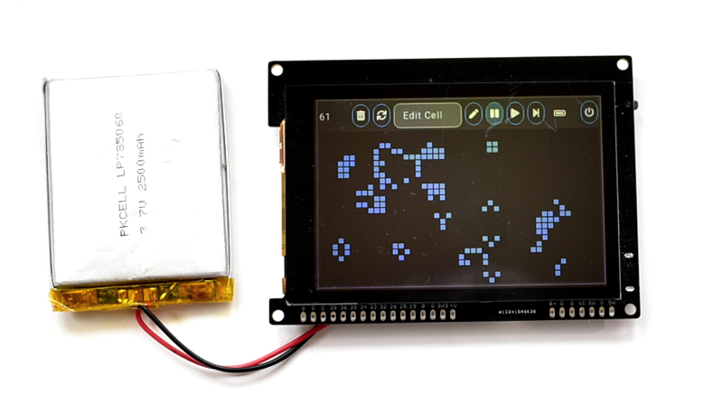
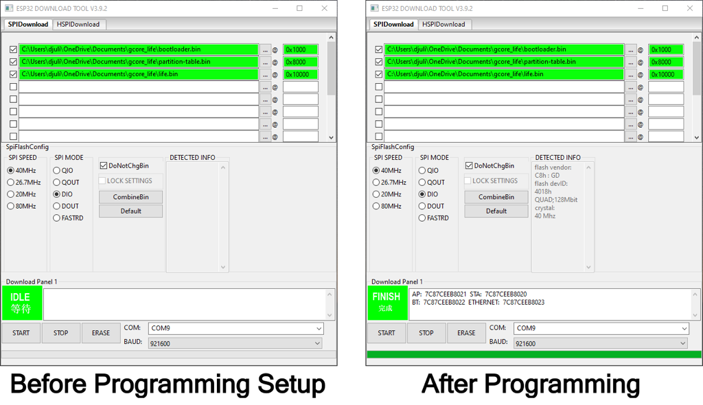

# The game of Life on gCore



A tribute to John Conway who wrote one of the quintessential computer programs.  An interactive game of Life running on [gCore](https://github.com/danjulio/gCore) using version 6.1.2 of the LVGL graphics library (back when it had cool pre-defined themes).

Click the Pencil icon to edit the field or add predefined objects from the drop-down menu.

Compiled with Espressif IDF v4.4.4 although it should work with other versions.

Build the project using the command ```idf.py build```.
	
Flash it onto gCore using the command ```idf.py -p (PORT) flash``` where (PORT) is the hardware serial port connected to gCore.

Precompiled binary files in the ```precompiled``` subdirectory may be loaded without having to install the ESP32 IDF or build the project by using the Espressif Windows-based [Flash Download Tool](https://www.espressif.com/en/support/download/other-tools).  

1. Download the binary files and put them in a known location (such as a diretory in the Documents folder).
2. Download and install the utility program in a known location (such as an Applications folder in the user's home folder).
3. Connect gCore to your computer and turn it on.
4. Run the utility program by double clicking on the executible file in the installation directory.  You may have to click through some warnings about running unknown programs that Windows will display.
5. Select ESP32 to program.
6. In the programming window that is displayed, select the SPIDownload tab, 40MHz SPI SPEED, DIO SPI Mode and load the three binary files at the locations shown in the following table by clicking the `...` buttons.  Make sure to select each file for programming by checking the checkmark box to the left of the file path.
7. Set a high baud rate like 921600 baud and select the COM port that is attached to gCore.
8. Hit START to initiate programming.  You should see the tool identify the ESP32 and display information and a progress bar increase as programming occurs.  The process should take only about 10-20 seconds.
9. Press RESET on gCore to start the demo running after programming is complete.

| File | Offset |
| --- | --- |
| bootloader.bin | 0x1000 |
| partition-table.bin | 0x8000 |
| life.bin | 0x10000 |



Turn gCore off by pressing and releasing the power button for more than a second or touching the power icon on the screen.

 